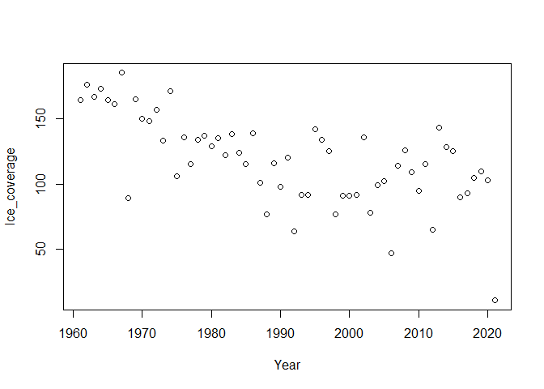

NOTE: This package is under development, and a few functions are
undergoing a re-write. Additionally, more complete documentation and
test cases are in progress.

<!-- README.md is generated from README.Rmd. Please edit that file -->

# icicle

<!-- badges: start -->
<!-- badges: end -->

The goal of icicle is to calculate and tidy ice cycle variables from
flow data collected by the Water Survey of Canada. This package provides
a set of functions that calculate the freeze/thaw dates, onset of
freshet, and length of continuous ice coverage for each year. Additional
tidying functions remove years from the dataframe with consecutive NA
values, and add a column for “day of the year”.

## Installation

You can install the development version of icicle from
[GitHub](https://github.com/) with:

``` r
#install.packages("devtools")
devtools::install_github("Jacqui-123/icicle")
```

## Example

This is a basic example of how you might use the functions in this
package:

``` r

library(icicle)
#import data from tidyhydat using tidyhydat::hy_daily_flows()
#here we use a prepared test data file
data_example <- read.csv("testdata.csv")
```

Add a Julian date, or “day of the year” to the data frame

``` r
library(icicle)
#add a day of the year
data_doy <- ice_day_of_wyear(data_example)
```

| Date      | waterYear | STATION_NUMBER | Parameter | Value | Symbol | day_of_year |
|:----------|----------:|:---------------|:----------|------:|:-------|------------:|
| 10/1/1960 |      1961 | 07HA001        | Flow      |  1140 | NA     |           1 |
| 10/2/1960 |      1961 | 07HA001        | Flow      |  1080 | NA     |           2 |
| 10/3/1960 |      1961 | 07HA001        | Flow      |  1030 | E      |           3 |
| 10/4/1960 |      1961 | 07HA001        | Flow      |   980 | NA     |           4 |
| 10/5/1960 |      1961 | 07HA001        | Flow      |   957 | NA     |           5 |
| 10/6/1960 |      1961 | 07HA001        | Flow      |   895 | NA     |           6 |

Calculate the length of continuous ice coverage using the “B” dates
marked on the Water Survey of Canada’s database

``` r
library(icicle)
library(tidyverse)

#tidy and format data
data_doy <- data_doy %>%
  dplyr::mutate(waterYear = as.character(waterYear)) %>%
  dplyr::mutate(Date = as.Date(Date)) 

results_g1 <- ice_group_1(data_doy)
```

| Year | Ice_coverage |
|:-----|-------------:|
| 1961 |          164 |
| 1962 |          176 |
| 1963 |          167 |

Plot the results of ice coverage for each year


Calculate the freeze and thaw dates for each year using the onset of
continuous “B” dates

``` r
library(icicle)
results_g2 <- ice_group_2(data_doy)
```

|     | Year | Freeze_Date | Freeze_DOY | Flow_Freeze | Thaw_Date  | Thaw_DOY | Flow_Thaw |
|:----|:-----|:------------|-----------:|------------:|:-----------|---------:|----------:|
| 7   | 1967 | 0011-01-19  |         32 |        1290 | 0005-05-19 |      217 |      4300 |
| 8   | 1968 | 0011-09-19  |         40 |         813 | 0002-06-19 |      129 |       323 |
| 9   | 1969 | 0011-07-19  |         38 |         697 | NA         |      203 |      1970 |

\`\`\`
